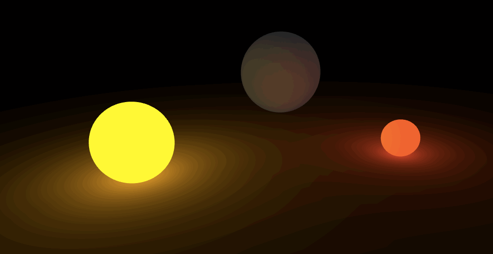
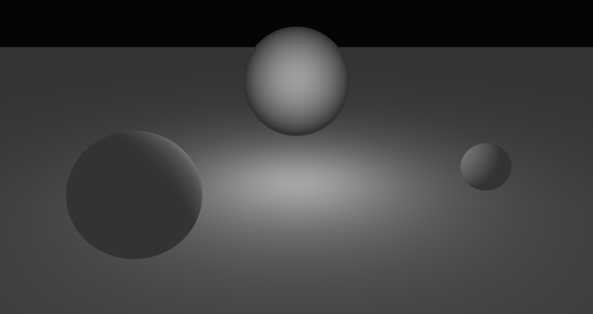
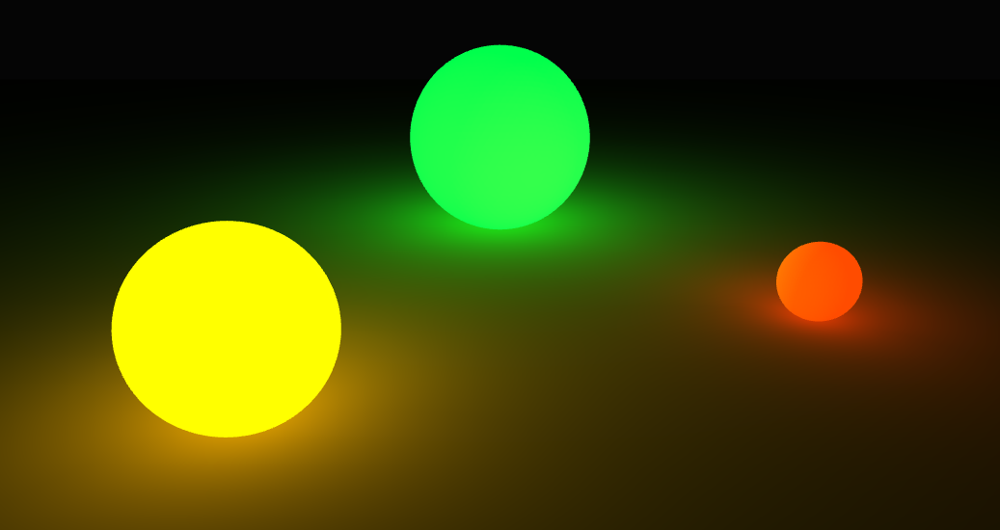

# gl-scene

[](http://github.com/badges/stability-badges)


Assemble simple 3d scenes using [`stack.gl`](http://stack.gl) components. The goal of this module is to make it easy to assemble and manipulate dynamic scenes with shapes and lights, at a slightly higher level of abstraction, while maintaining full flexibility and composability with the [`stack.gl`](http://stack.gl) ecosystem, including the emphasis on writing modular shader code. You can think of this module as a wrapper for [`gl-geometry`](http://github.com/stackgl/gl-geometry), [`gl-shader`](http://github.com/stackgl/gl-shader), and [`gl-mat4`](http://github.com/stackgl/gl-mat4), with an easy selector system for controlling appearences.



## install

For now, clone the repo and install with

```javascript
npm install
```

See a simple example by calling

```javascript
npm run example
```

And see a more complex example with

```bash
npm run demo < fruit | cubes | balls >
```

## example

First get yourself a `webgl` context. There are many ways to do this, but here's an easy one.

```javascript
var canvas = document.body.appendChild(document.createElement('canvas'))
var gl = require('gl-context')(canvas)
require('canvas-fit')(canvas)
```

Now create the scene, passing options for background color and viewer position

```javascript
var scene = require('gl-scene')(gl, {
  viewer: [0, -18, 8], 
  background: [0.02, 0.02, 0.02]
})
```

A scene requires a list of shapes. It can additionally include lights and custom materials. We'll make a simple scene consisting of three spheres on a flat surface. We can set an `id` for selecting later, and we specify a `position` and/or `scale`, which automatically gets turned into a `4x4` model matrix.

```javascript
var icosphere = require('icosphere')
var extrude = require('extrude')

var shapes = [
  {
    complex: extrude([[-50, 50], [-50, -50], [50, -50], [50, 50]], {top: 0, bottom: -2}),
    position: [0, 0, 0],
    styles: {diffuse: [0.3, 0.3, 0.3]}
  },
  {
    complex: icosphere(4),
    position: [8, 0, 1],
    styles: {emissive: [0.8, 0.1, 0.0], diffuse: [0.1, 0.1, 0.1]}
  },
  {
    complex: icosphere(4),
    position: [-5, -5, 2], scale: 2,
    styles: {emissive: [0.9, 0.6, 0.0], diffuse: [0.1, 0.1, 0.1]}
  },
  {
    complex: icosphere(4),
    position: [0, 8, 3], scale: 3,
    styles: {emissive: [0.0, 0.9, 0.1], diffuse: [0.1, 0.1, 0.1]}
  }
]
```

Then add these shapes to our scene, initialize, and draw!

```javascript
scene.shapes(shapes)
scene.init()
scene.draw()
```

It should look like:



We didn't specify any lights, so we got the default: a white light above the origin. Let's add a bright colored light centered on each sphere. We define a list of lights just as we did with shapes.

```javascript
var lights = [
  {
    position: [0, 8, 3, 1], 
    styles: {color: [0.0, 0.9, 0.1], brightness: 8.0, ambient: 0.0, attenuation: 0.01}},
  {
    position: [8, 0, 1, 1], 
    styles: {color: [0.8, 0.1, 0.0], brightness: 8.0, ambient: 0.0, attenuation: 0.01}},
  {
    position: [-5, -5, 2, 1], 
    styles: {color: [0.9, 0.6, 0.0], brightness: 8.0, ambient: 0.0, attenuation: 0.01}}
]
```

Add the lights to the scene, reinitialize, and redraw!

```javascript
scene.lights(lights)
scene.init()
scene.draw()
```

Glowing fruit!



See the [example](example.js) for a script that generates this image, and see the [fruit demo](demos/fruit.js) for a version that adds a moveable `camera` and uses `select` to dynamically turn the glowing on and off.

## features

#### stylesheet

You can add a stylesheet to your scene, and give each shape and light an `id` and a `className`, which makes it easy to set or update styles. For example in the above example we could have set each light to have the class `glow` and each shape `sphere` and then set common styles using

```javascript
var stylesheet = {
  '.glow': {brightness: 8.0, ambient: 0.0, attenuation: 0.01}
  '.sphere': {diffuse: [0.1, 0.1, 0.1]}
}

scene.stylesheet(stylesheet)
```

#### selections

You can select shapes and lights by `id` or `class` and change their properties with methods inspired by `d3`. For example, this would raise all `glow` lights and increase their brightness:

```javascript
scene.selectAll('.glow').position([0, 0, 5]).style({brightness: 16.0})
```

## methods

### initialization

#### `scene(gl, opts)`

Construct a scene by providing a `webgl` context. [expand]

#### `scene.shapes(shapes)`

Add a list of `shapes` to the scene, using a set of `styles`. [expand]

#### `scene.lights(lights)`

Add a list of `lights` to the scene, alongside a set of `styles`. [expand]

#### `scene.materials(materials)`

Specify a list of `materials` to use. [expand]

### rendering

#### `scene.init()`

Initialize the scene, check that required properties are defined, and replace missing properties with defaults where possible, as follows. For shapes without a material, the material will be `flat`. If a shape has undefined material properties, they will be replaced with the defaults.

#### `scene.update(camera)`

Update the scene's projection and view matrices from the provided `camera`, which must have a `view` method. For examples see: `canvas-orbit-camera`

#### `scene.draw()`

Draw the scene to the `webgl` context.

### manipulation

All manipulation works by first selecting an element -- a shape or a light -- and then changing its properties.

#### `scene.select(selector)`

Returns the first `element` that matches the given tag. Selector should be of the form: `#id`, `.class`, `shape #id`, `shape .class`, `light #id`, or `light .class`. If `shape` or `light` is unspecified, will first look for a matching shape, and then a matching light.


#### `element.hide()`

Hide the given element. For a shape, will remove it from the scene. For a light, will remove its effect on the scene.

#### `element.show()`

Show the given element. For a shape, will add it back to the scene. For a light, will include its effect on the scene.

#### `element.toggle()`

Show or hide the given element depending on its current state.

#### `element.move(func)`

Move an element by providing a function `func` that should take as input a `model` matrix (for shapes) or a `position` vector (for lights), and modify it in place.

```javascript
scene.find('shape #earth').move(function (model) {mat4.translate(model, model, [0, 5, 0])})
```
```javascript
scene.find('light #sun').move(function (position) {position[1] += 5})
```

#### `element.style({name: value})`

Set one or more style properties on the element.

```javascript
scene.find('shape #earth').style({emissive: [0.6, 0.2, 0.1]})
```
```javascript
scene.find('light #sun').style({color: [0.5, 0.5, 0.5]})
```

#### `element.classed(name, value)`

Set class `name` on the element to `value`, which should be truthy.

```javascript
scene.find('shape #earth').classed('planet', false)
```

#### `element.toggleClass(name)`

Add or remove class `name` on the given element depending on its current state.

```javascript
scene.find('shape #earth').toggleClass('planet')
```

## TODO

- Make selection work on lists via a `selectAll` operator
- Support multiple classes per element
- Tests!
