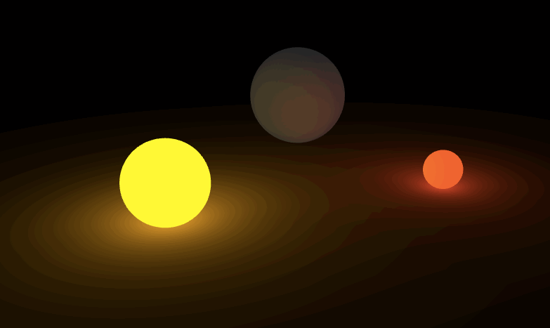
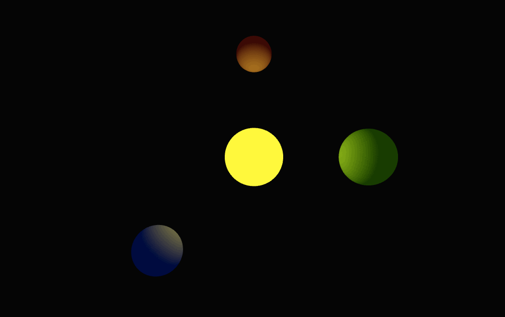

# gl-scene

Assemble simple 3d scenes using [`stack.gl`](http://stack.gl) components. The goal of this module is to make it easy to assemble shapes and lights into a scene, at a slightly higher level of abstraction, while maintaining full flexibility and composability with the `stack.gl` ecosystem. You can think of this module as a wrapper for `gl-geometry`, `gl-shader`, and `gl-mat4`, with an easy selector system for controlling appearences.



## install

Add to your project with

```javascript
npm install gl-scene --save
```

See a simple example by cloning this repo then calling

```javascript
npm start
```

And see a more complex example with

```javascript
npm run demo
```

## example

First get yourself a `webgl` context. There are many ways to do this, but here's an easy one.

```javascript
var canvas = document.body.appendChild(document.createElement('canvas'))
var gl = require('gl-context')(canvas)
require('canvas-fit')(canvas)
```

Now create the scene, passing options for background color and viewer position

```javascript
var scene = require('gl-scene')(gl, {
  viewer: [0, -5, 20], 
  background: [0.02, 0.02, 0.02]
})
```

A scene requires a list of shapes. It can additionally include lights and custom materials. We'll make a simple scene consisting of four spheres, representing three planets and a sun. We can set an `id` and `class` for styling later, and we specify a 4x4 `model` matrix, which controls rotation, translation, and scale.

```javascript
var icosphere = require('icosphere')

var shapes = [
  {
    id: 'sun', class: 'star'
    complex: icosphere(4),
    model: [2, 0, 0, 0, 0, 2, 0, 0, 0, 0, 2, 0, 0, 0, 0, 1]
  },
  {
    id: 'earth', class: 'planet',
    complex: icosphere(4),
    model: [1.5, 0, 0, 0, 0, 1.5, 0, 0, 0, 0, 1.5, 0, 6, 0, 0, 1]
  },
  {
    id: 'mars', class: 'planet',
    complex: icosphere(4),
    model: [1, 0, 0, 0, 0, 1, 0, 0, 0, 0, 1, 0, 0, 6, 0, 1]
  },
  {
    id: 'neptune', class: 'planet',
    complex: icosphere(4),
    model: [1.25, 0, 0, 0, 0, 1.25, 0, 0, 0, 0, 1.25, 0, -4.8, -4.8, 0, 1]
  }
]
```

We can set styles by mapping `id` or `class` to material properties. We'll add a diffuse component to all planets, a different ambient color to each one, and an emissive color on the sun.

```javascript
var styles = [
  {tag: '#sun', emissive: [0.9, 0.9, 0]},
  {tag: '#earth', ambient: [0.0, 0.4, 0.2]},
  {tag: '#mars', ambient: [0.6, 0.1, 0.1]},
  {tag: '#neptune', ambient: [0.0, 0.2, 0.4]},
  {tag: '.planet', diffuse: [0.9, 0.9, 0.9]}
]
```

We can add these shapes, with styles, to our scene, initialize, and draw!

```javascript
scene.shapes(shapes, styles)
scene.init()
scene.draw()
```

It should look like:


We didn't specify any lights, so we got a default white light above the origin. Let's make our own: a bright yellow light at the origin to represent the sun! Specify an `id` and 4x1 `position`.

```javascript
var lights = [
  {id: 'sun', position: [0, 0, 2, 1]}
]
```

Set styles by making it bright yellow and moderately ambient.

```javascript
var styles = [
  {tag: '#sun', color: [0.9, 0.9, 0.0], brightness: 2.5, ambient: 0.5, attenuation: 0.01}
]
```

Add it to the scene, reinitialize, and draw.

```javascript
scene.lights(lights, styles)
scene.init()
scene.draw()
```

And you'll see:


Finally, let's add a simple animation, where the sun grows and shrinks, and the light gets brighter and dimmer. You can `select` both shapes and lights and then use functions like `move` and `style` to dynamically change their properties.

```javascript
setInterval(function () {
  var d = Math.sin(scene.frame / 30)
  scene.select('#sun').move(function (m) {mat4.scale(m, mat4.create(), [2 + d, 2 + d, 2 + d])})
  scene.select('light #sun').style({brightness: 2.5 + d * 1.5})
  scene.draw()
}, 10)
```
Fun!



## methods

### initialization

#### `scene(gl, opts)`

Construct a scene by providing a `webgl` context. [expand]

#### `scene.shapes(shapes, styles)`

Add a list of `shapes` to the scene, using a set of `styles`. [expand]

#### `scene.lights(lights, styles)`

Add a list of `lights` to the scene, alongside a set of `styles`. [expand]

#### `scene.materials(materials)`

Specify a list of `materials` to use. [expand]

### rendering

#### `scene.init()`

Initialize the scene, check that required properties are defined, and replace missing properties with defaults where possible, as follows. For shapes without a material, the material will be `flat`. If a shape has undefined material properties, they will be replaced with the defaults.

#### `scene.update(camera)`

Update the scene's projection and view matrices from the provided `camera`, which must have a `view` method. For examples see: `canvas-orbit-camera`

#### `scene.draw()`

Draw the scene to the `webgl` context.

### manipulation

All manipulation works by first selecting an element -- a shape or a light -- and then changing its properties.

#### `scene.select(selector)`

Returns the first `element` that matches the given tag. Selector should be of the form: `#id`, `.class`, `shape #id`, `shape .class`, `light #id`, or `light .class`. If `shape` or `light` is unspecified, will first look for a matching shape, and then a matching light.


#### `element.hide()`

Hide the given element. For a shape, will remove it from the scene. For a light, will remove its effect on the scene.

#### `element.show()`

Show the given element. For a shape, will add it back to the scene. For a light, will include its effect on the scene.

#### `element.toggle()`

Show or hide the given element depending on its current state.

#### `element.move(func)`

Move an element by providing a function `func` that should take as input a `model` matrix (for shapes) or a `position` vector (for lights), and modify it in place.

```javascript
scene.find('shape #earth').move(function (model) {mat4.translate(model, model, [0, 5, 0])})
```
```javascript
scene.find('light #sun').move(function (position) {position[1] += 5})
```

#### `element.style({name: value})`

Set one or more style properties on the element.

```javascript
scene.find('shape #earth').style({emissive: [0.6, 0.2, 0.1]})
```
```javascript
scene.find('light #sun').style({color: [0.5, 0.5, 0.5]})
```

#### `element.classed(name, value)`

Set class `name` on the element to `value`, which should be truthy.

```javascript
scene.find('shape #earth').classed('planet', false)
```

#### `element.toggleClass(name)`

Add or remove class `name` on the given element depending on its current state.

```javascript
scene.find('shape #earth').toggleClass('planet')
```

## TODO

- Make selection work on lists via a `selectAll` operator
- Support multiple classes per element
